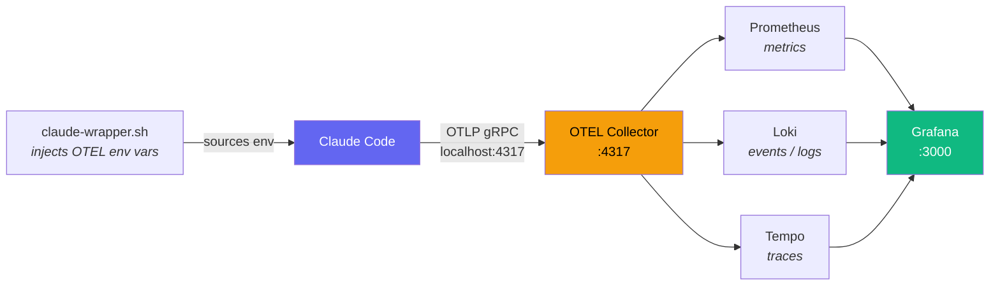

# claude-otel-stack

Local OTEL stack for monitoring Claude Code sessions. Metrics, events, and traces via Grafana.

Claude Code is unaffected if the stack is offline — the OTEL exporter is fire-and-forget.

**Repo:** https://github.com/jewzaam/claude-otel-stack

## How it Works

A shell wrapper injects OTEL environment variables before launching Claude Code. Telemetry flows over OTLP gRPC to a local collector, which fans out to three backends. Grafana queries all three for unified dashboards.




## Prerequisites

### podman

https://podman.io/docs/installation

```bash
sudo dnf install podman

systemctl --user enable --now podman.socket
```

### podman-compose

```bash
python -m pip install podman-compose
```

## Setup

```bash
# 1. Clone and start the stack
git clone https://github.com/jewzaam/claude-otel-stack.git
cd claude-otel-stack
podman-compose up -d

# 2. Add to ~/.bashrc (one-time)
alias claude=~/source/claude-otel-stack/bin/claude-wrapper.sh

# 3. Launch Claude — telemetry flows automatically
claude
```

The wrapper sets OTEL env vars and injects `project=$(pwd)` at launch time, so each session is tagged with the directory it was started from. See `bin/claude-wrapper.sh` for the full list of vars.

## Autostart (optional)

```bash
cp systemd/claude-otel-stack.service ~/.config/systemd/user/
systemctl --user daemon-reload
systemctl --user enable --now claude-otel-stack
```

## Grafana

http://localhost:3000 — no login required.

Import dashboards from `dashboards/`:
- `grafana-dashboard.json` — Session Monitor (cost, tokens, cache ratio, active time)
- `grafana-dashboard-cost.json` — Cost & Token Breakdown (cost by session/model/project, token usage, cache hit ratio, edit decisions)
- `grafana-dashboard-events.json` — Event Analytics (event rates, tool usage, breakdowns by session/model/project)

Import: Dashboards → New → Import → Upload JSON file.

## Ports

| Service | Port |
|---------|------|
| Grafana | 3000 |
| Prometheus | 9090 |
| Loki | 3100 |
| Tempo | 3200 |
| OTEL Collector | 4317 |

## Tear down

```bash
podman-compose down       # keeps data
podman-compose down -v    # deletes all stored data
```

## Docs

- `docs/tips.md` — gotchas and query patterns (SELinux, Loki structured metadata, LogQL)
- `docs/thoughts.md` — design rationale, architecture options, what signals mean
