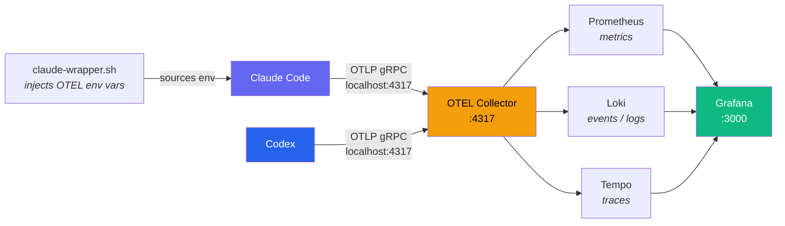

# claude-otel-stack

Local OTEL stack for monitoring coding-agent sessions. Metrics and events via Grafana, with optional trace storage.

Claude Code is unaffected if the stack is offline — the OTEL exporter is fire-and-forget.

**Repo:** https://github.com/jewzaam/claude-otel-stack

## How it Works

Claude Code uses a shell wrapper to inject OTEL environment variables. Codex uses its native OTEL configuration. Both can send telemetry over OTLP to the local collector, which fans out to Prometheus and Loki; Tempo is available for clients that export traces.


```mermaid
flowchart LR
    CC["Claude Code"]
    CX["Codex"]
    W["claude-wrapper.sh<br/><i>injects OTEL env vars</i>"]
    OC["OTEL Collector<br/>:4317"]
    P["Prometheus<br/><i>metrics</i>"]
    L["Loki<br/><i>events / logs</i>"]
    T["Tempo<br/><i>traces</i>"]
    G["Grafana<br/>:3000"]

    W -- sources env --> CC
    CC -- "OTLP gRPC<br/>localhost:4317" --> OC
    CX -- "OTLP gRPC<br/>localhost:4317" --> OC
    OC --> P
    OC --> L
    OC --> T
    P --> G
    L --> G
    T --> G

    style CC fill:#6366f1,color:#fff
    style CX fill:#2563eb,color:#fff
    style OC fill:#f59e0b,color:#000
    style G fill:#10b981,color:#fff
```


## Prerequisites

### podman

https://podman.io/docs/installation

```bash
sudo dnf install podman

systemctl --user enable --now podman.socket
```

### podman-compose

```bash
python -m pip install podman-compose
```

## Setup

```bash
# 1. Clone and start the stack
git clone https://github.com/jewzaam/claude-otel-stack.git
cd claude-otel-stack
podman-compose up -d

# 2. Add to ~/.bashrc (one-time)
alias claude=~/source/claude-otel-stack/bin/claude-wrapper.sh

# 3. Launch Claude — telemetry flows automatically
claude
```

The wrapper sets OTEL env vars and injects `project=$(pwd)` at launch time, so each session is tagged with the directory it was started from. See `bin/claude-wrapper.sh` for the full list of vars.

### Codex

Codex has a native OpenTelemetry exporter. Configure it in the user-level `~/.codex/config.toml`; project-local `.codex/config.toml` files cannot set telemetry routing.

```toml
[otel]
environment = "dev"
log_user_prompt = true       # optional; exports raw prompts

exporter = { otlp-grpc = {
  endpoint = "http://localhost:4317"
} }

metrics_exporter = { otlp-grpc = {
  endpoint = "http://localhost:4317"
} }
```

The `exporter` sends structured OTel logs to Loki. Events include API requests, SSE/WebSocket events, prompts, tool decisions, and tool results. `metrics_exporter` sends Codex counters and duration histograms through the collector to Prometheus. Codex batches exports asynchronously, so exiting a session is useful when validating a new configuration.

Codex does not need to export traces for this stack. The Tempo service and trace pipeline remain available, but the useful Codex signals currently land in Loki and Prometheus.

See the [Codex observability and telemetry documentation](https://learn.chatgpt.com/docs/config-file/config-advanced#observability-and-telemetry) and [configuration reference](https://learn.chatgpt.com/docs/config-file/config-reference#otelmetrics_exporter).

## Autostart (optional)

```bash
cp systemd/claude-otel-stack.service ~/.config/systemd/user/
systemctl --user daemon-reload
systemctl --user enable --now claude-otel-stack
```

## Grafana

http://localhost:3000 — no login required.

Dashboards sync automatically — a sidecar container pushes JSON files to Grafana on startup and keeps them in sync bidirectionally. Edit a dashboard in the Grafana UI and the JSON file updates on disk. Edit the JSON file and Grafana picks up the change. No manual import needed.

Available dashboards in `dashboards/`:
- **`grafana-dashboard-unified.json`** — Unified (recommended daily driver — cost, tokens, skills, tools, traces, prompt history, API requests; filterable by project and session)
- `grafana-dashboard.json` — Session Monitor (cost, tokens, cache ratio, active time)
- `grafana-dashboard-cost.json` — Cost & Token Breakdown (cost by session/model/project, token usage, cache hit ratio, edit decisions)
- `grafana-dashboard-events.json` — Event Analytics (event rates, tool usage, breakdowns by session/model/project)
- `grafana-dashboard-skills.json` — Skill Usage (slash commands, Skill tool calls, decisions, activity over time)
- `grafana-dashboard-session.json` — Session Detail (drill into a single session — cost, tokens, traces, prompt history, API requests; filterable by project)

## Local Grafana (dashboard iteration against remote backends)

For fast dashboard iteration without redeploying the full stack — useful when Prom/Loki/Tempo run elsewhere (k3s, tailnet, cloud) and only Grafana needs to run locally.

```bash
# 1. Create your personal datasource config (gitignored)
cp config/grafana-datasources.local.yaml.example config/grafana-datasources.local.yaml

# 2. Edit URLs in the new file to point at your Prom/Loki/Tempo endpoints

# 3. Start
make local-up        # http://localhost:3001
make local-logs      # tail logs
make local-restart   # restart
make local-down      # stop (keeps volume)
```

Dashboards in `dashboards/` auto-push every 10s via the `dashboard-sync-local` sidecar. Edits in the UI write back to JSON. Datasource UIDs match the dashboard JSON, so panels resolve without remapping.

The real `config/grafana-datasources.local.yaml` is gitignored — personal endpoints stay local.

## Ports

| Service | Port |
|---------|------|
| Grafana | 3000 |
| Prometheus | 9090 |
| Loki | 3100 |
| Tempo | 3200 |
| OTEL Collector (OTLP gRPC) | 4317 |
| OTEL Collector (OTLP HTTP) | 4318 |
| OTEL Collector (Prometheus scrape) | 8889 |

## Tear down

```bash
podman-compose down       # keeps data
podman-compose down -v    # deletes all stored data
```

## Docs

- [Claude Code Monitoring](https://docs.anthropic.com/en/docs/claude-code/monitoring-usage) — upstream Anthropic docs on OTEL env vars, metrics, events, and traces
- `docs/tips.md` — gotchas and query patterns (SELinux, Loki structured metadata, LogQL)
- `docs/thoughts.md` — design rationale, architecture options, what signals mean
